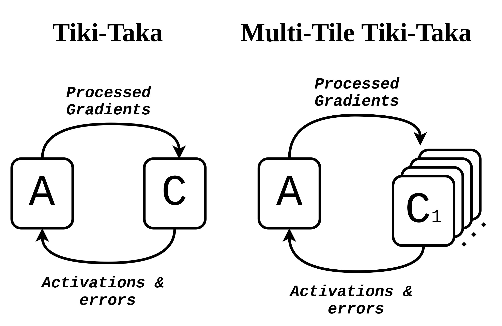
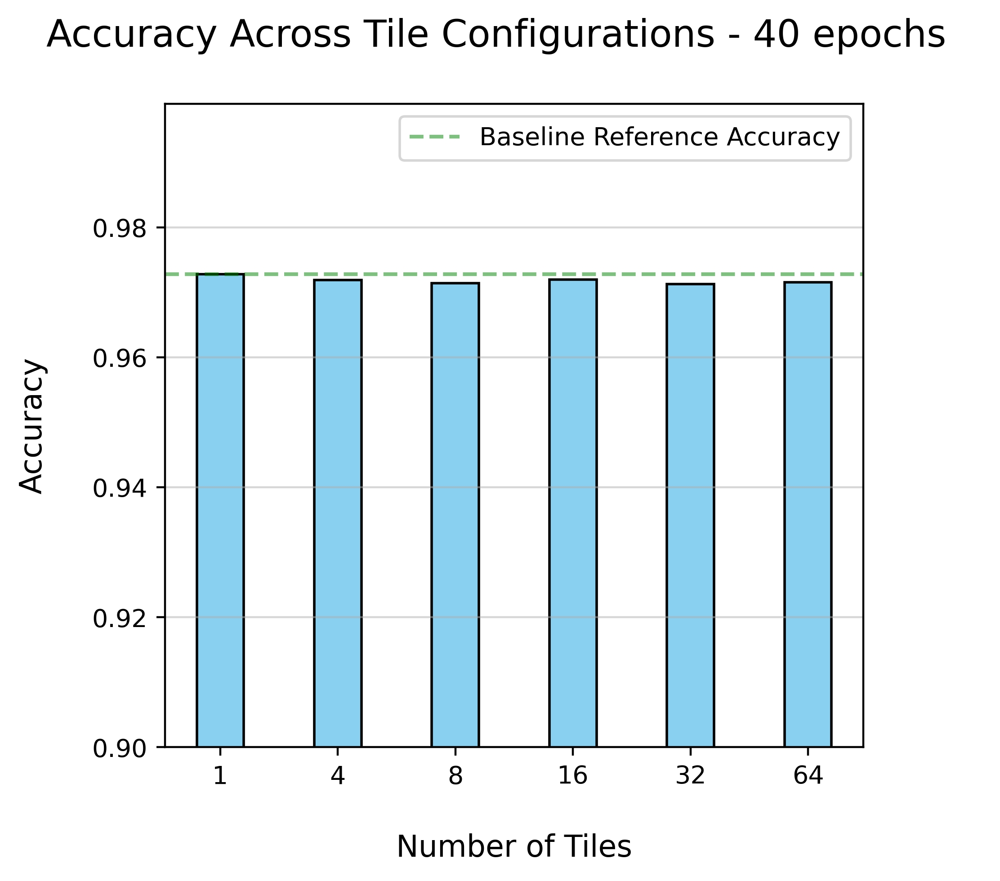

# Accelerated Analog In-Memory Computing for Neural Network Training

**Authors:** I. J. Gallo, J. A. del Alamo  

Analog in-memory computing (AIMC) provides a promising route to accelerate neural network training by performing matrix–vector multiplications directly within memory arrays. This approach leverages the physical properties of analog devices such as protonic synapses to deliver significant improvements in energy efficiency and speed over conventional digital methods.

However, a major limitation of analog crossbar arrays is their inability to process multiple inputs simultaneously.  
To address this, we propose a **multi-tile parallel processing architecture** that accelerates existing algorithms such as **Tiki-Taka** by introducing **parallelism at the algorithmic level**.

Using **IBM’s [AIHWKit](https://github.com/IBM/aihwkit)** simulation framework, our implementation distributes computation across multiple crossbar tiles, enabling parallel input processing while maintaining high accuracy.  
Experiments on the **MNIST dataset** show that the parallel version maintains over **97 % accuracy** compared to standard Tiki-Taka implementations, while achieving a substantial reduction in training time.

<p align="center">
  <br>
  <em>Figure 1: Architecture diagram of the proposed multi-tile parallel processing approach for accelerated Tiki-Taka.</em>
</p>

<p align="center">
  <br>
  <em>Figure 2: MNIST classification accuracy comparison between standard and parallel implementations, demonstrating maintained performance despite parallelization.</em>
</p>

---

## Repository Overview

This repository is organized as follows:

### 🧩 `Research_1/`
Contains didactic and from-scratch implementations of the basic **Tiki-Taka** algorithm in plain **PyTorch**, primarily in notebook format.  
It includes:
- Exploratory work on **AIHWKit** and its integration with Tiki-Taka.  
- Early tests of **batched (multi-tile)** Tiki-Taka implementations.  
- Experiments on small-scale toy problems, such as a **3-class spiral classification task**, to illustrate algorithmic behavior and validate functionality.

### ⚡ `Research_2/`
Focuses on **scaling and analysis** of the proposed methods, including:
- Experiments with **stochastic weight averaging (SWA)** and other temporal averaging strategies.  
- Numerous scripts within the `SHD_script/` folder with different experiment setups. 
- Experiments and results on the **MNIST** dataset, including **logging**, **energy estimation**, and **runtime analysis** (see `plot.ipynb`).
- The full intermidiate results are not included, since the data exceeds the repository limit.

---


---

## Repository Structure and Notes

The full source code of **AIHWKit** is included in this repository to ensure compatibility with the modified components used in our experiments.  

However, the **relevant and modified files** for this work are located in:  
```
aihwkit/simulator/tiles/
```

The key modified or newly introduced files are:

- `multi_tile_periphery.py`  
- `transfer_for_simple_TT.py`  
- `transfer_for_batched_TT.py`  
- `transfer_for_batched_TTv2.py`  
- `transfer_for_batched_TTv2_log.py`  
- `transfer_for_batched_TTv2_v2.py`  
- `transfer_for_batched_TTv2_v2_log.py`

---

## Reference

> M. Onen, T. Gokmen, T. K. Todorov, T. Nowicki, J. A. del Alamo, J. Rozen, W. Haensch, and S. Kim,  
> “Neural Network Training with Asymmetric Crosspoint Elements,”  
> *Frontiers in Artificial Intelligence*, vol. 5, Article 891624, 2022.  
> [https://doi.org/10.3389/frai.2022.891624](https://doi.org/10.3389/frai.2022.891624)
